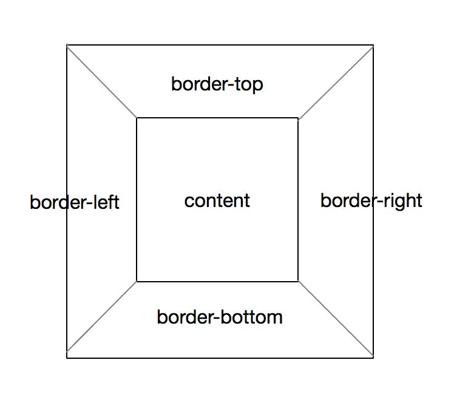
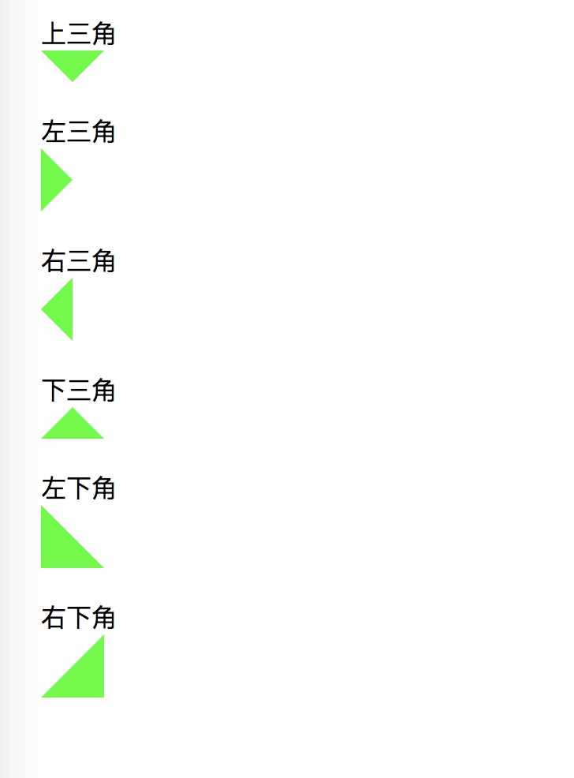

## css 实现三角形及其原理

css 实现三角形的原理其实很简单，就是利用border来实现的。

如果单独设置border-top，border-left，border-right和border-bottom，那么这几个边框形状是四方形的。可是如果同时设置了相邻的边框，那么必然会有一个正方形的重叠，那相邻的的border就会以一个斜边平分这个正方形，形成一个斜角：



那么实现三角形就很简单了，只要把div的宽高设置为0，然后设置border就好了：[test.html](https://github.com/yukiyuki1900/workspace/blob/master/css%E5%AE%9E%E7%8E%B0%E4%B8%89%E8%A7%92%E5%BD%A2%E5%8F%8A%E5%85%B6%E5%8E%9F%E7%90%86/test.html)




css:

```
.list {
	margin: 20px;
}

.triangle-top {
	height: 0;
	width: 0;
	border-left: 20px solid transparent;
	border-top: 20px solid #00ff00;
	border-right: 20px solid transparent;
}

.triangle-left {
	height: 0;
	width: 0;
	border-left: 20px solid #00ff00;
	border-top: 20px solid transparent;
	border-bottom: 20px solid transparent;
}

.triangle-right {
	height: 0;
	width: 0;
	border-right: 20px solid #00ff00;
	border-top: 20px solid transparent;
	border-bottom: 20px solid transparent;
}

.triangle-bottom {
	height: 0;
	width: 0;
	border-left: 20px solid transparent;
	border-right: 20px solid transparent;
	border-bottom: 20px solid #00ff00;
}

.triangle-left-bottom {
	height: 0;
	width: 0;
	border-top: 20px solid transparent;
	border-left: 20px solid #00ff00;
	border-right: 20px solid transparent;
	border-bottom: 20px solid #00ff00;
}

.triangle-right-bottom {
	height: 0;
	width: 0;
	border-top: 20px solid transparent;
	border-left: 20px solid transparent;
	border-right: 20px solid #00ff00;
	border-bottom: 20px solid #00ff00;
}
```

html：

```
<div class="list">
	<span class="title">上三角</span>
	<div class="triangle-top"></div>
</div>

<div class="list">
	<span class="title">左三角</span>
	<div class="triangle-left"></div>
</div>

<div class="list">
	<span class="title">右三角</span>
	<div class="triangle-right"></div>
</div>

<div class="list">
	<span class="title">下三角</span>
	<div class="triangle-bottom"></div>
</div>

<div class="list">
	<span class="title">左下角</span>
	<div class="triangle-left-bottom"></div>
</div>

<div class="list">
	<span class="title">右下角</span>
	<div class="triangle-right-bottom"></div>
</div>
```